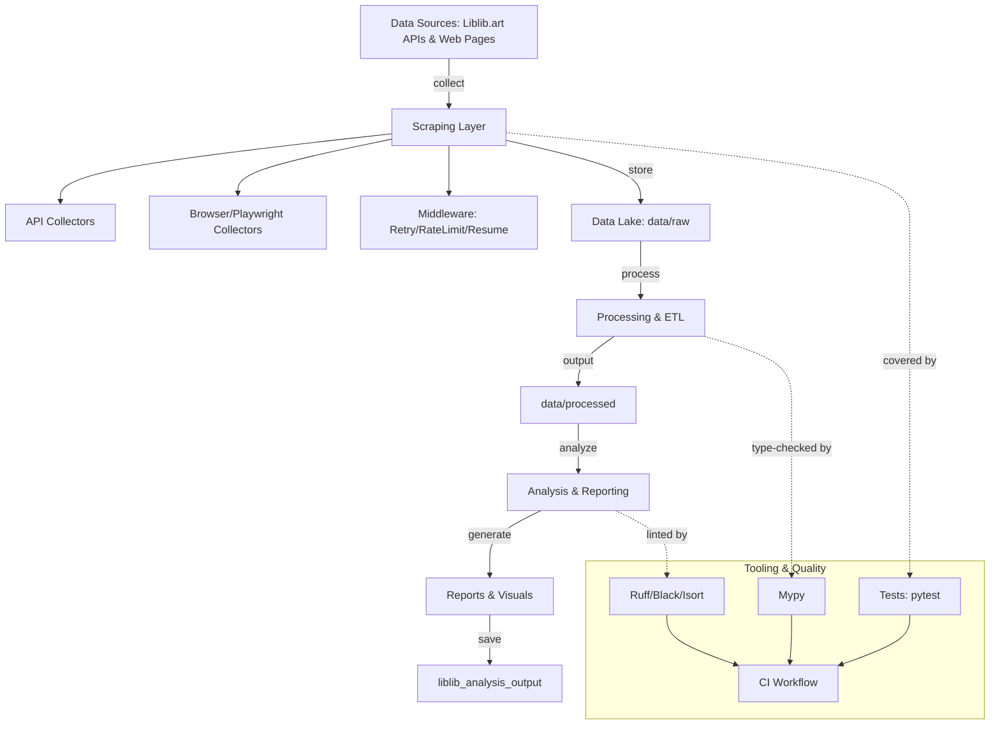

### Architecture Overview

#### System

#### Directories

- `scripts/`: data collection, download, analysis entry points.
- `data/`: raw, processed, and images; outputs in `liblib_analysis_output/`.
- `tests/`: unit & integration tests; configured via root `pytest.ini`.
- `docs/`: usage guides, standards, and architecture.

